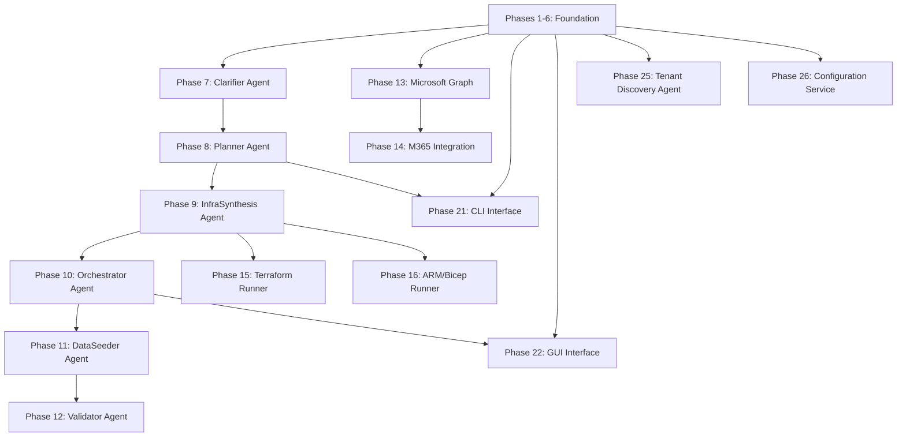

# SimBuilder Phase 7-24 Implementation Roadmap

> **Status**: Ready for implementation  
> **Prerequisites**: Phases 1-6 complete (346 tests passing)  
> **Target**: Complete SimBuilder platform with AI agents, Azure integrations, and user interfaces

## Executive Summary

This roadmap details the implementation of **18 remaining phases** (7-24) to complete the SimBuilder platform. Building on the solid foundation of phases 1-6 (configuration, graph DB, service bus, LLM integration, API gateway, and spec management), these phases add the core AI agents, Azure service integrations, infrastructure runners, and user interfaces.

### Implementation Tracks

The roadmap is organized into **4 parallel development tracks**:

1. **🤖 AI Agent Track** (Phases 7-12): Core AI functionality and simulation orchestration
2. **☁️ Azure Integration Track** (Phases 13-18): Infrastructure runners and Azure service integrations  
3. **🖥️ Interface Track** (Phases 19-22): User interfaces and external API access
4. **🔧 Platform Track** (Phases 23-24): Tenant discovery and centralized configuration

---

## Phase-by-Phase Breakdown

### Phase 7: Clarifier Agent 🤖
**Component**: [`05-clarifier-agent`](../specs/components/05-clarifier-agent/clarifier-agent.md)

#### Objective & Scope
Transform user-provided attack scenarios into complete specifications through AI-driven interactive questioning using Azure OpenAI and Autogen Core framework.

#### Key Components/Files
- `src/simbuilder_clarifier/agent.py` - Autogen Core-based clarification agent
- `src/simbuilder_clarifier/session.py` - Session management and state persistence
- `src/simbuilder_clarifier/questions.py` - Question generation and prioritization logic
- `src/simbuilder_clarifier/completeness.py` - Specification completeness assessment
- `src/simbuilder_clarifier/cli.py` - CLI interface for clarification sessions
- `prompts/clarifier/*.liquid` - External Liquid prompt templates
- `tests/simbuilder_clarifier/` - Comprehensive test suite

#### External Dependencies
- Azure OpenAI GPT-4 (live integration required for testing)
- Microsoft Autogen Core framework
- MITRE ATT&CK framework data
- Microsoft Learn knowledge base

#### Test Strategy
- **Unit**: Question generation, completeness scoring, session management, Liquid template validation
- **Integration**: Live Azure OpenAI sessions, multi-turn conversations, Graph DB persistence, Service Bus messaging
- **E2E**: Complete attack scenario clarification from vague descriptions to structured specs

#### Acceptance Criteria
- Generate 5-15 relevant questions for typical scenarios with 90%+ completeness scores
- Question generation within 3 seconds, response processing within 2 seconds
- All prompts loaded from external Liquid templates with graceful failure handling
- Support session interruption and resume functionality

#### Estimated Effort
**Large (L)** - Complex AI agent with multi-turn conversation handling, template management, and Azure OpenAI integration

---

### Phase 8: Planner Agent 🤖
**Component**: [`06-planner-agent`](../specs/components/06-planner-agent/planner-agent.md)

#### Objective & Scope
Transform attack specifications into detailed resource plans including Azure infrastructure, identities, networks, and telemetry requirements.

#### Key Components/Files
- `src/simbuilder_planner/agent.py` - AI-driven resource planning agent
- `src/simbuilder_planner/resource_analyzer.py` - Azure resource requirement analysis
- `src/simbuilder_planner/cost_estimator.py` - Budget analysis and optimization
- `src/simbuilder_planner/dependency_resolver.py` - Resource dependency mapping
- `src/simbuilder_planner/cli.py` - Planning CLI interface
- `prompts/planner/*.liquid` - Resource planning prompt templates
- `tests/simbuilder_planner/` - Testing infrastructure

#### External Dependencies
- Azure Resource Manager APIs
- Azure Pricing Calculator APIs
- Attack specification schemas from Phase 7

#### Test Strategy
- **Unit**: Resource analysis, cost calculation, dependency resolution, template rendering
- **Integration**: Live Azure ARM API calls, specification parsing, Graph DB storage
- **E2E**: Complete planning workflow from attack spec to deployable resource plan

#### Acceptance Criteria
- Generate accurate resource plans with proper dependency ordering
- Cost estimates within 10% of actual Azure pricing
- Plan generation within 60 seconds for typical scenarios
- Support plan optimization and alternative recommendations

#### Estimated Effort
**Large (L)** - Complex resource analysis, Azure API integration, and cost optimization logic

---

### Phase 9: InfraSynthesis Agent 🤖
**Component**: [`07-infrasynthesis-agent`](../specs/components/07-infrasynthesis-agent/infrasynthesis-agent.md)

#### Objective & Scope
Generate Infrastructure-as-Code templates (Terraform, Bicep, ARM) from resource plans with proper dependency management and deployment strategies.

#### Key Components/Files
- `src/simbuilder_infrasynthesis/agent.py` - IaC generation agent
- `src/simbuilder_infrasynthesis/terraform_generator.py` - Terraform template generation
- `src/simbuilder_infrasynthesis/bicep_generator.py` - Bicep template generation
- `src/simbuilder_infrasynthesis/arm_generator.py` - ARM template generation
- `src/simbuilder_infrasynthesis/validator.py` - Template syntax validation
- `src/simbuilder_infrasynthesis/cli.py` - IaC generation CLI
- `prompts/infrasynthesis/*.liquid` - Code generation prompt templates
- `tests/simbuilder_infrasynthesis/` - Multi-provider testing

#### External Dependencies
- Terraform providers and validation tools
- Azure Bicep CLI and validation
- Azure Resource Manager template validation APIs

#### Test Strategy
- **Unit**: Template generation logic, syntax validation, multi-provider support
- **Integration**: Live template validation with Azure services, dependency correctness
- **E2E**: Complete IaC generation and deployment validation

#### Acceptance Criteria
- Generate syntactically valid templates for all three providers (Terraform, Bicep, ARM)
- 95%+ deployment success rate for generated templates
- Template generation within 60 seconds
- Support complex multi-resource dependencies

#### Estimated Effort
**Large (L)** - Multi-provider template generation with complex dependency management

---

### Phase 10: Orchestrator Agent 🤖
**Component**: [`08-orchestrator-agent`](../specs/components/08-orchestrator-agent/orchestrator-agent.md)

#### Objective & Scope
Coordinate entire simulation deployment workflow, manage resource provisioning, monitor progress, and handle rollback scenarios.

#### Key Components/Files
- `src/simbuilder_orchestrator/agent.py` - Central deployment orchestrator
- `src/simbuilder_orchestrator/workflow_engine.py` - Step-by-step deployment coordination
- `src/simbuilder_orchestrator/state_manager.py` - Deployment state tracking
- `src/simbuilder_orchestrator/rollback_handler.py` - Failure recovery and cleanup
- `src/simbuilder_orchestrator/progress_tracker.py` - Real-time progress monitoring
- `src/simbuilder_orchestrator/cli.py` - Orchestration CLI commands
- `tests/simbuilder_orchestrator/` - Workflow testing suite

#### External Dependencies
- Terraform and Bicep runners (Phases 15-16)
- Azure Resource Manager APIs
- Service Bus for workflow coordination

#### Test Strategy
- **Unit**: Workflow logic, state management, rollback scenarios, progress tracking
- **Integration**: Multi-step deployment coordination, real Azure resource provisioning
- **E2E**: Complete simulation deployment with failure handling and recovery

#### Acceptance Criteria
- Orchestrate complex multi-step deployments with proper dependency ordering
- Real-time progress reporting with 95%+ accuracy
- Automatic rollback on failures with complete cleanup
- Support concurrent deployment management

#### Estimated Effort
**Large (L)** - Complex workflow orchestration with state management and error handling

---

### Phase 11: DataSeeder Agent 🤖
**Component**: [`09-dataseeder-agent`](../specs/components/09-dataseeder-agent/dataseeder-agent.md)

#### Objective & Scope
Generate synthetic identities, organizational structures, and realistic content to populate simulation environments with believable attack preconditions.

#### Key Components/Files
- `src/simbuilder_dataseeder/agent.py` - Data seeding orchestrator
- `src/simbuilder_dataseeder/identity_generator.py` - Synthetic identity creation
- `src/simbuilder_dataseeder/org_structure.py` - Organizational hierarchy generation
- `src/simbuilder_dataseeder/content_generator.py` - Realistic data content creation
- `src/simbuilder_dataseeder/relationship_mapper.py` - Cross-tenant relationship modeling
- `src/simbuilder_dataseeder/cli.py` - Data seeding CLI interface
- `prompts/dataseeder/*.liquid` - Data generation prompt templates
- `tests/simbuilder_dataseeder/` - Data quality testing

#### External Dependencies
- Microsoft Graph APIs for identity management
- Azure AD B2C for user provisioning
- Faker libraries for synthetic data generation

#### Test Strategy
- **Unit**: Identity generation, data synthesis, relationship mapping, content validation
- **Integration**: Live Microsoft Graph integration, Azure AD provisioning
- **E2E**: Complete environment population with realistic organizational structures

#### Acceptance Criteria
- Generate believable synthetic identities with proper organizational relationships
- Populate environments with realistic data volumes and diversity
- Maintain data consistency across multi-tenant scenarios
- Support custom data seeding patterns and templates

#### Estimated Effort
**Medium (M)** - Data generation logic with Microsoft Graph integration

---

### Phase 12: Validator Agent 🤖
**Component**: [`10-validator-agent`](../specs/components/10-validator-agent/validator-agent.md)

#### Objective & Scope
Validate simulation environments for readiness, verify attack preconditions, and ensure proper telemetry collection capabilities.

#### Key Components/Files
- `src/simbuilder_validator/agent.py` - Environment validation orchestrator
- `src/simbuilder_validator/precondition_checker.py` - Attack precondition validation
- `src/simbuilder_validator/telemetry_validator.py` - Telemetry collection verification
- `src/simbuilder_validator/security_checker.py` - Security configuration validation
- `src/simbuilder_validator/health_monitor.py` - Environment health assessment
- `src/simbuilder_validator/cli.py` - Validation CLI interface
- `tests/simbuilder_validator/` - Validation testing framework

#### External Dependencies
- Azure Monitor and Log Analytics APIs
- Azure Security Center integration
- Sentinel Analytics APIs

#### Test Strategy
- **Unit**: Validation logic, precondition checking, health monitoring, telemetry verification
- **Integration**: Live Azure service validation, security configuration checking
- **E2E**: Complete environment readiness validation across multiple scenarios

#### Acceptance Criteria
- Validate attack preconditions with 95%+ accuracy
- Verify telemetry collection capabilities across all required sources
- Generate detailed validation reports with remediation recommendations
- Support continuous environment health monitoring

#### Estimated Effort
**Medium (M)** - Validation logic with Azure service integration

---

### Phase 13: Microsoft Graph/Entra Integration ☁️
**Component**: [`11-microsoft-graph-entra-integration`](../specs/components/11-microsoft-graph-entra-integration/microsoft-graph-entra-integration.md)

#### Objective & Scope
Integrate with Microsoft Graph and Entra ID for identity management, user provisioning, and organizational structure setup.

#### Key Components/Files
- `src/simbuilder_graph_integration/client.py` - Microsoft Graph API client
- `src/simbuilder_graph_integration/identity_manager.py` - User and group management
- `src/simbuilder_graph_integration/permission_manager.py` - Role and permission assignment
- `src/simbuilder_graph_integration/org_provisioner.py` - Organizational unit provisioning
- `src/simbuilder_graph_integration/cli.py` - Graph integration CLI
- `tests/simbuilder_graph_integration/` - Microsoft Graph testing

#### External Dependencies
- Microsoft Graph APIs (live integration required)
- Azure AD B2C/Entra ID
- MSAL authentication libraries

#### Test Strategy
- **Unit**: API client logic, identity operations, permission management
- **Integration**: Live Microsoft Graph API calls, real user provisioning
- **E2E**: Complete organizational setup and identity management workflows

#### Acceptance Criteria
- Successful user and group provisioning across Azure AD tenants
- Accurate permission and role assignment management
- Support for complex organizational structures and hierarchies
- Proper error handling and retry logic for API operations

#### Estimated Effort
**Medium (M)** - Microsoft Graph integration with identity management logic

---

### Phase 14: Microsoft 365 Integration ☁️
**Component**: [`12-microsoft-365-integration`](../specs/components/12-microsoft-365-integration/microsoft-365-integration.md)

#### Objective & Scope
Integrate with Microsoft 365 services for environment population including Exchange, SharePoint, Teams, and realistic M365 data generation.

#### Key Components/Files
- `src/simbuilder_m365/client.py` - M365 service integration client
- `src/simbuilder_m365/exchange_provisioner.py` - Exchange Online setup and email generation
- `src/simbuilder_m365/sharepoint_provisioner.py` - SharePoint site and content creation
- `src/simbuilder_m365/teams_provisioner.py` - Teams workspace setup
- `src/simbuilder_m365/content_generator.py` - Realistic M365 content creation
- `src/simbuilder_m365/cli.py` - M365 integration CLI
- `tests/simbuilder_m365/` - M365 service testing

#### External Dependencies
- Microsoft 365 APIs (Exchange, SharePoint, Teams)
- Graph APIs for M365 resource management
- PowerShell modules for M365 administration

#### Test Strategy
- **Unit**: Service provisioning logic, content generation, API integration
- **Integration**: Live M365 service provisioning, real content creation
- **E2E**: Complete M365 environment setup with realistic organizational content

#### Acceptance Criteria
- Successful provisioning of Exchange, SharePoint, and Teams resources
- Generation of realistic organizational content and communications
- Support for custom M365 configuration patterns
- Proper integration with identity management from Phase 13

#### Estimated Effort
**Large (L)** - Complex M365 service integration with content generation

---

### Phase 15: Terraform Runner ☁️
**Component**: [`13-terraform-runner`](../specs/components/13-terraform-runner/terraform-runner.md)

#### Objective & Scope
Execute Terraform templates with state management, plan validation, and deployment monitoring for infrastructure provisioning.

#### Key Components/Files
- `src/simbuilder_terraform/runner.py` - Terraform execution engine
- `src/simbuilder_terraform/state_manager.py` - Terraform state file management
- `src/simbuilder_terraform/plan_validator.py` - Terraform plan analysis and validation
- `src/simbuilder_terraform/output_parser.py` - Terraform output processing
- `src/simbuilder_terraform/cli.py` - Terraform runner CLI
- `tests/simbuilder_terraform/` - Terraform execution testing

#### External Dependencies
- Terraform CLI and providers
- Azure Resource Manager for state backend
- Terraform Cloud/Enterprise (optional)

#### Test Strategy
- **Unit**: Execution logic, state management, plan validation, output parsing
- **Integration**: Live Terraform execution with real Azure resources
- **E2E**: Complete infrastructure deployment via Terraform with state persistence

#### Acceptance Criteria
- Reliable Terraform execution with proper error handling and logging
- Secure state file management with remote backend support
- Plan validation and approval workflows
- Support for Terraform modules and complex configurations

#### Estimated Effort
**Medium (M)** - Terraform execution logic with state management

---

### Phase 16: ARM/Bicep Runner ☁️
**Component**: [`14-arm-bicep-runner`](../specs/components/14-arm-bicep-runner/arm-bicep-runner.md)

#### Objective & Scope
Execute Azure Resource Manager and Bicep templates with deployment tracking, parameter management, and rollback capabilities.

#### Key Components/Files
- `src/simbuilder_arm/runner.py` - ARM/Bicep deployment engine
- `src/simbuilder_arm/deployment_tracker.py` - Azure deployment monitoring
- `src/simbuilder_arm/parameter_manager.py` - Template parameter handling
- `src/simbuilder_arm/rollback_handler.py` - Deployment rollback and cleanup
- `src/simbuilder_arm/cli.py` - ARM/Bicep runner CLI
- `tests/simbuilder_arm/` - ARM deployment testing

#### External Dependencies
- Azure CLI and Bicep tooling
- Azure Resource Manager APIs
- Azure DevOps (optional for advanced scenarios)

#### Test Strategy
- **Unit**: Deployment logic, parameter handling, monitoring, rollback scenarios
- **Integration**: Live Azure ARM deployments, real resource provisioning
- **E2E**: Complete infrastructure deployment with monitoring and rollback testing

#### Acceptance Criteria
- Successful ARM and Bicep template deployment with real-time monitoring
- Comprehensive parameter validation and secure handling
- Automatic rollback on deployment failures with complete cleanup
- Support for complex nested templates and linked deployments

#### Estimated Effort
**Medium (M)** - ARM/Bicep deployment logic with Azure integration

---

### Phase 17: Sentinel Analytics Integration ☁️
**Component**: [`15-sentinel-analytics-integration`](../specs/components/15-sentinel-analytics-integration/sentinel-analytics-integration.md)

#### Objective & Scope
Integrate with Azure Sentinel and Log Analytics for telemetry collection, attack detection, and security monitoring setup.

#### Key Components/Files
- `src/simbuilder_sentinel/client.py` - Sentinel API integration client
- `src/simbuilder_sentinel/analytics_configurator.py` - Analytics rule configuration
- `src/simbuilder_sentinel/data_connector.py` - Data source connector setup
- `src/simbuilder_sentinel/workbook_manager.py` - Sentinel workbook provisioning
- `src/simbuilder_sentinel/cli.py` - Sentinel integration CLI
- `tests/simbuilder_sentinel/` - Sentinel integration testing

#### External Dependencies
- Azure Sentinel APIs and Log Analytics
- Azure Monitor data collection APIs
- KQL (Kusto Query Language) for analytics

#### Test Strategy
- **Unit**: API integration, rule configuration, connector setup, workbook management
- **Integration**: Live Sentinel workspace configuration, real analytics rule deployment
- **E2E**: Complete security monitoring setup with attack detection validation

#### Acceptance Criteria
- Successful Sentinel workspace provisioning and configuration
- Automated analytics rule deployment with proper tuning
- Data connector setup for comprehensive telemetry collection
- Workbook and dashboard provisioning for attack monitoring

#### Estimated Effort
**Medium (M)** - Sentinel API integration with security configuration logic

---

### Phase 18: FinOps Alerting ☁️
**Component**: [`16-finops-alerting`](../specs/components/16-finops-alerting/finops-alerting.md)

#### Objective & Scope
Implement cost monitoring, budget enforcement, and financial governance with automated alerting and spend optimization.

#### Key Components/Files
- `src/simbuilder_finops/cost_monitor.py` - Azure cost tracking and analysis
- `src/simbuilder_finops/budget_enforcer.py` - Budget limit enforcement and alerts
- `src/simbuilder_finops/spend_optimizer.py` - Cost optimization recommendations
- `src/simbuilder_finops/alert_manager.py` - Cost alert and notification system
- `src/simbuilder_finops/cli.py` - FinOps management CLI
- `tests/simbuilder_finops/` - Cost monitoring testing

#### External Dependencies
- Azure Cost Management APIs
- Azure Billing APIs
- Azure Monitor for alerting infrastructure

#### Test Strategy
- **Unit**: Cost tracking logic, budget enforcement, alert generation, optimization algorithms
- **Integration**: Live Azure cost API integration, real billing data analysis
- **E2E**: Complete cost governance workflow with budget enforcement and alerting

#### Acceptance Criteria
- Real-time cost tracking with accurate budget monitoring
- Automated alerts at configurable budget thresholds (e.g., 80%, 90%, 100%)
- Cost optimization recommendations with actionable insights
- Integration with simulation lifecycle for automatic cleanup scheduling

#### Estimated Effort
**Small (S)** - Cost monitoring integration with alerting logic

---

### Phase 19: Auto-Cleanup Scheduler ☁️
**Component**: [`17-auto-cleanup-scheduler`](../specs/components/17-auto-cleanup-scheduler/auto-cleanup-scheduler.md)

#### Objective & Scope
Automated resource cleanup and TTL management to prevent cost overruns and maintain environment hygiene.

#### Key Components/Files
- `src/simbuilder_cleanup/scheduler.py` - Cleanup scheduling and orchestration
- `src/simbuilder_cleanup/resource_scanner.py` - Azure resource discovery and tagging
- `src/simbuilder_cleanup/ttl_manager.py` - Time-to-live management and enforcement
- `src/simbuilder_cleanup/cleanup_executor.py` - Safe resource deletion logic
- `src/simbuilder_cleanup/cli.py` - Cleanup management CLI
- `tests/simbuilder_cleanup/` - Cleanup logic testing

#### External Dependencies
- Azure Resource Manager APIs for resource enumeration
- Azure tagging services
- Cron/scheduler for automated execution

#### Test Strategy
- **Unit**: Scheduling logic, resource discovery, TTL management, deletion safety checks
- **Integration**: Live Azure resource scanning and cleanup operations
- **E2E**: Complete resource lifecycle management with automated cleanup validation

#### Acceptance Criteria
- Automated resource discovery with proper tagging and TTL assignment
- Safe cleanup operations with multiple confirmation and safety checks
- Configurable TTL policies for different resource types and environments
- Comprehensive logging and audit trail for all cleanup operations

#### Estimated Effort
**Small (S)** - Resource cleanup logic with scheduler integration

---

### Phase 20: AKS Autoscaler Manager ☁️
**Component**: [`18-aks-autoscaler-manager`](../specs/components/18-aks-autoscaler-manager/aks-autoscaler-manager.md)

#### Objective & Scope
Manage Azure Kubernetes Service autoscaling and resource optimization for containerized simulation workloads.

#### Key Components/Files
- `src/simbuilder_aks/autoscaler_manager.py` - AKS autoscaler configuration and management
- `src/simbuilder_aks/cluster_monitor.py` - AKS cluster monitoring and metrics
- `src/simbuilder_aks/resource_optimizer.py` - Container resource optimization
- `src/simbuilder_aks/scaling_policies.py` - Autoscaling policy management
- `src/simbuilder_aks/cli.py` - AKS management CLI
- `tests/simbuilder_aks/` - AKS integration testing

#### External Dependencies
- Azure Kubernetes Service APIs
- Kubernetes cluster access and kubectl
- Azure Monitor for container insights

#### Test Strategy
- **Unit**: Autoscaler configuration, monitoring logic, scaling policies, resource optimization
- **Integration**: Live AKS cluster management, real autoscaling scenarios
- **E2E**: Complete container workload management with autoscaling validation

#### Acceptance Criteria
- Successful AKS cluster autoscaler configuration and management
- Real-time cluster monitoring with resource optimization recommendations
- Dynamic scaling policies based on workload patterns and cost considerations
- Integration with overall simulation resource management

#### Estimated Effort
**Small (S)** - AKS management integration with autoscaling logic

---

### Phase 21: CLI Interface 🖥️
**Component**: [`19-cli-interface`](../specs/components/19-cli-interface/cli-interface.md)

#### Objective & Scope
Comprehensive command-line interface unifying all SimBuilder capabilities with rich output formatting and interactive features.

#### Key Components/Files
- `src/simbuilder_cli/main.py` - Main CLI application and command routing
- `src/simbuilder_cli/commands/` - Individual command implementations (sim, agent, deploy, etc.)
- `src/simbuilder_cli/formatting.py` - Rich output formatting and tables
- `src/simbuilder_cli/interactive.py` - Interactive command workflows
- `src/simbuilder_cli/config_manager.py` - CLI configuration and preferences
- `tests/simbuilder_cli/` - CLI testing framework

#### External Dependencies
- Typer for CLI framework
- Rich for enhanced terminal output
- All previous phases for command implementation

#### Test Strategy
- **Unit**: Command parsing, output formatting, interactive workflows, configuration management
- **Integration**: End-to-end command execution across all SimBuilder modules
- **E2E**: Complete simulation lifecycle management via CLI interface

#### Acceptance Criteria
- Unified CLI interface covering all SimBuilder capabilities
- Rich output formatting with tables, progress bars, and color coding
- Interactive workflows for complex operations
- Comprehensive help system and command documentation

#### Estimated Effort
**Medium (M)** - Comprehensive CLI integration across all modules

---

### Phase 22: GUI Interface 🖥️
**Component**: [`20-gui-interface`](../specs/components/20-gui-interface/gui-interface.md)

#### Objective & Scope
React-based web interface with graph visualization, simulation management, and real-time monitoring capabilities.

#### Key Components/Files
- `src/simbuilder_gui/frontend/` - React application structure
- `src/simbuilder_gui/frontend/src/components/` - UI components (SimulationGraph, Dashboard, etc.)
- `src/simbuilder_gui/frontend/src/pages/` - Application pages and routing
- `src/simbuilder_gui/frontend/src/services/` - API integration services
- `src/simbuilder_gui/backend/` - FastAPI backend for GUI-specific endpoints
- `tests/simbuilder_gui/` - Frontend and backend testing

#### External Dependencies
- React and modern JavaScript ecosystem
- D3.js or similar for graph visualization
- Material-UI or similar component library
- WebSocket support for real-time updates

#### Test Strategy
- **Unit**: Component testing, API service testing, backend endpoint testing
- **Integration**: Frontend-backend integration, real-time data updates
- **E2E**: Complete user workflows via web interface with Cypress/Playwright

#### Acceptance Criteria
- Responsive web interface with modern UI/UX design
- Interactive graph visualization of simulation environments
- Real-time monitoring and progress tracking
- Complete simulation lifecycle management via web interface

#### Estimated Effort
**Large (L)** - Modern web application with complex graph visualization

---

### Phase 23: REST API Gateway 🖥️
**Component**: [`21-rest-api-gateway`](../specs/components/21-rest-api-gateway/rest-api-gateway.md)

#### Objective & Scope
External REST API gateway for third-party integrations with authentication, rate limiting, and comprehensive API documentation.

#### Key Components/Files
- `src/simbuilder_api_gateway/gateway.py` - API gateway application and routing
- `src/simbuilder_api_gateway/auth.py` - Authentication and authorization middleware
- `src/simbuilder_api_gateway/rate_limiter.py` - Rate limiting and throttling
- `src/simbuilder_api_gateway/documentation.py` - OpenAPI specification generation
- `src/simbuilder_api_gateway/middleware.py` - Request/response middleware
- `tests/simbuilder_api_gateway/` - API gateway testing

#### External Dependencies
- FastAPI for gateway implementation
- Redis for rate limiting and caching
- OAuth2/JWT for authentication

#### Test Strategy
- **Unit**: Gateway routing, authentication, rate limiting, middleware functionality
- **Integration**: Third-party API integration, authentication flow testing
- **E2E**: Complete external API workflow with authentication and rate limiting

#### Acceptance Criteria
- Secure external API access with proper authentication and authorization
- Rate limiting and throttling to prevent abuse
- Comprehensive API documentation with OpenAPI specification
- Support for API versioning and backward compatibility

#### Estimated Effort
**Medium (M)** - API gateway with security and documentation features

---

### Phase 24: MCP Service 🖥️
**Component**: [`22-mcp-service`](../specs/components/22-mcp-service/mcp-service.md)

#### Objective & Scope
Model Context Protocol service enabling AI assistants and LLM applications to programmatically interact with SimBuilder capabilities.

#### Key Components/Files
- `src/simbuilder_mcp/server.py` - MCP server implementation
- `src/simbuilder_mcp/tools/` - MCP tool implementations (create_sim, query_env, etc.)
- `src/simbuilder_mcp/resources/` - MCP resource providers
- `src/simbuilder_mcp/client.py` - MCP client for testing and validation
- `src/simbuilder_mcp/schema.py` - MCP protocol schema definitions
- `tests/simbuilder_mcp/` - MCP protocol testing

#### External Dependencies
- MCP protocol libraries and standards
- WebSocket or HTTP transport for MCP communication
- Integration with existing SimBuilder APIs

#### Test Strategy
- **Unit**: MCP tool implementation, resource providers, protocol handling
- **Integration**: MCP client-server communication, SimBuilder API integration
- **E2E**: Complete AI assistant workflows via MCP protocol

#### Acceptance Criteria
- Full MCP protocol compliance with proper tool and resource definitions
- Seamless integration with popular AI assistants and LLM applications
- Real-time communication via WebSocket or HTTP transport
- Comprehensive tool coverage for all major SimBuilder operations

#### Estimated Effort
**Medium (M)** - MCP protocol implementation with AI assistant integration

---

### Phase 25: Tenant Discovery Agent 🔧
**Component**: [`23-tenant-discovery-agent`](../specs/components/23-tenant-discovery-agent/tenant-discovery-agent.md)

#### Objective & Scope
Azure tenant resource enumeration and Neo4j graph population with intelligent narrative generation for discovered environments.

#### Key Components/Files
- `src/simbuilder_tenant_discovery/agent.py` - Tenant discovery orchestration agent
- `src/simbuilder_tenant_discovery/resource_enumerator.py` - Azure resource discovery
- `src/simbuilder_tenant_discovery/graph_populator.py` - Neo4j graph population
- `src/simbuilder_tenant_discovery/narrative_generator.py` - AI-driven environment description
- `src/simbuilder_tenant_discovery/cli.py` - Tenant discovery CLI
- `tests/simbuilder_tenant_discovery/` - Discovery testing framework

#### External Dependencies
- Azure Resource Graph APIs
- Existing tenant discovery configuration (Phase 1)
- Graph database integration (Phase 2)
- LLM integration for narrative generation (Phase 4)

#### Test Strategy
- **Unit**: Resource enumeration, graph population, narrative generation, discovery logic
- **Integration**: Live Azure tenant scanning, real graph database population
- **E2E**: Complete tenant discovery workflow with narrative generation

#### Acceptance Criteria
- Comprehensive Azure tenant resource discovery and enumeration
- Accurate Neo4j graph population with proper relationship modeling
- AI-generated narratives describing discovered environments
- Integration with existing configuration and database systems

#### Estimated Effort
**Medium (M)** - Azure resource discovery with graph population and AI narrative generation

---

### Phase 26: Configuration Service 🔧
**Component**: [`24-config-service`](../specs/components/24-config-service/config-service.md)

#### Objective & Scope
Centralized configuration management service providing unified settings distribution, validation, and runtime configuration updates across all SimBuilder modules.

#### Key Components/Files
- `src/simbuilder_config_service/service.py` - Central configuration service
- `src/simbuilder_config_service/validator.py` - Configuration validation and schema checking
- `src/simbuilder_config_service/distributor.py` - Configuration distribution to modules
- `src/simbuilder_config_service/updater.py` - Runtime configuration updates
- `src/simbuilder_config_service/cli.py` - Configuration management CLI
- `tests/simbuilder_config_service/` - Configuration service testing

#### External Dependencies
- All existing SimBuilder modules for configuration integration
- Redis or similar for configuration caching
- Configuration schema definitions

#### Test Strategy
- **Unit**: Configuration validation, distribution logic, update mechanisms, schema validation
- **Integration**: Cross-module configuration distribution, real-time updates
- **E2E**: Complete configuration lifecycle management across all SimBuilder components

#### Acceptance Criteria
- Centralized configuration management with validation and schema enforcement
- Real-time configuration distribution to all SimBuilder modules
- Runtime configuration updates without service restarts
- Comprehensive configuration audit trail and versioning

#### Estimated Effort
**Small (S)** - Configuration service building on existing scaffolding patterns

---

## Branch Naming Convention

Use the following standardized branch naming pattern:

```
feature/phase-{NN}-{component-name}
```

**Examples**:
- `feature/phase-07-clarifier-agent`
- `feature/phase-13-microsoft-graph-integration`
- `feature/phase-21-cli-interface`

**For PR groupings**:
- `feature/phase-07-10-ai-agents-track`
- `feature/phase-13-18-azure-integrations`

---

## Suggested PR Breakdown

### Track 1: AI Agents (Phases 7-12)
**PR Group A**: Core AI Agents
- **PR A1**: Phase 7 (Clarifier Agent) + Phase 8 (Planner Agent)
- **PR A2**: Phase 9 (InfraSynthesis Agent) + Phase 10 (Orchestrator Agent)  
- **PR A3**: Phase 11 (DataSeeder Agent) + Phase 12 (Validator Agent)

### Track 2: Azure Integrations (Phases 13-20)
**PR Group B**: Microsoft Integrations
- **PR B1**: Phase 13 (Microsoft Graph/Entra) + Phase 14 (Microsoft 365)
- **PR B2**: Phase 15 (Terraform Runner) + Phase 16 (ARM/Bicep Runner)
- **PR B3**: Phase 17 (Sentinel Analytics) + Phase 18 (FinOps Alerting)
- **PR B4**: Phase 19 (Auto-Cleanup) + Phase 20 (AKS Autoscaler)

### Track 3: User Interfaces (Phases 21-24)
**PR Group C**: Interface Layer
- **PR C1**: Phase 21 (CLI Interface) - *Can start after A1 complete*
- **PR C2**: Phase 22 (GUI Interface) - *Can start after A2 complete*
- **PR C3**: Phase 23 (REST API Gateway) + Phase 24 (MCP Service)

### Track 4: Platform Services (Phases 25-26)
**PR Group D**: Platform Completion
- **PR D1**: Phase 25 (Tenant Discovery Agent) - *Requires Phases 1, 2, 4*
- **PR D2**: Phase 26 (Configuration Service) - *Final integration*

---

## Risk & Dependency Matrix

### High-Risk Phases
| Phase | Risk Level | Primary Risk | Mitigation Strategy |
|-------|------------|--------------|-------------------|
| 7 (Clarifier Agent) | **HIGH** | Complex AI conversation handling | Early prototyping, extensive testing with Azure OpenAI |
| 9 (InfraSynthesis) | **HIGH** | Multi-provider IaC generation complexity | Start with single provider, expand incrementally |
| 14 (M365 Integration) | **HIGH** | M365 API complexity and permissions | Incremental service integration, robust error handling |
| 22 (GUI Interface) | **HIGH** | Complex graph visualization requirements | Use proven visualization libraries, iterative UI development |

### Critical Dependencies


### External Dependencies
| Phase | External Dependency | Criticality | Fallback Strategy |
|-------|-------------------|-------------|-------------------|
| 7, 8, 9 | Azure OpenAI GPT-4 | **CRITICAL** | Local LLM fallback, API key rotation |
| 13 | Microsoft Graph APIs | **CRITICAL** | Service principal management, permission pre-approval |
| 14 | M365 Admin APIs | **HIGH** | Gradual service integration, mock data for testing |
| 15 | Terraform CLI | **MEDIUM** | Version pinning, local installation |
| 16 | Azure CLI/Bicep | **MEDIUM** | Azure CLI containers, version management |
| 17 | Azure Sentinel | **MEDIUM** | Basic Log Analytics fallback |

---

## High-Level Timeline & Parallel Execution

### Execution Phases

#### **Phase 1: Foundation Completion** (Weeks 1-2)
- **Dependency**: Complete any remaining work from Phases 1-6
- **Deliverable**: Stable foundation with 100% passing tests

#### **Phase 2: Core AI Agents** (Weeks 3-8)
- **Track A1**: Phases 7-8 (Clarifier + Planner) - Weeks 3-6
- **Track A2**: Phases 9-10 (InfraSynthesis + Orchestrator) - Weeks 5-8
- **Parallel execution possible**: Track A2 can start when Track A1 reaches 70% completion

#### **Phase 3: Parallel Development** (Weeks 7-14)
- **Track B**: Azure Integrations (Phases 13-16) - Weeks 7-12
- **Track A3**: DataSeeder + Validator (Phases 11-12) - Weeks 9-11
- **Track C1**: CLI Interface (Phase 21) - Weeks 11-13
- **Full parallel execution**: All tracks can proceed simultaneously

#### **Phase 4: Advanced Integration** (Weeks 13-18)
- **Track B2**: Sentinel + FinOps + Cleanup + AKS (Phases 17-20) - Weeks 13-16
- **Track C2**: GUI Interface (Phase 22) - Weeks 15-18
- **Track C3**: API Gateway + MCP (Phases 23-24) - Weeks 17-18

#### **Phase 5: Platform Completion** (Weeks 19-20)
- **Track D**: Tenant Discovery + Config Service (Phases 25-26) - Weeks 19-20
- **Integration Testing**: Cross-component validation and testing

### Gantt Chart Overview

```mermaid
gantt
    title SimBuilder Phase 7-24 Implementation Timeline
    dateFormat X
    axisFormat %w
    
    section Foundation
    Phases 1-6 Completion    :done, foundation, 0, 2w
    
    section AI Agents Track
    Clarifier + Planner      :active, agents1, 2w, 4w
    InfraSynthesis + Orchestrator :agents2, 4w, 4w
    DataSeeder + Validator   :agents3, 8w, 3w
    
    section Azure Integration Track  
    Microsoft Graph + M365   :azure1, 6w, 4w
    Terraform + ARM Runners  :azure2, 8w, 3w
    Sentinel + FinOps + Cleanup :azure3, 12w, 4w
    
    section Interface Track
    CLI Interface           :interface1, 10w, 3w
    GUI Interface          :interface2, 14w, 4w
    API Gateway + MCP      :interface3, 16w, 3w
    
    section Platform Track
    Tenant Discovery + Config :platform, 18w, 2w
```

### Resource Allocation Recommendations

**For 2-3 Developer Team**:
- **Senior Developer**: AI Agents track (complex LLM integration)
- **Mid-Level Developer**: Azure Integrations track (API integrations)
- **Junior Developer**: Platform track + testing support

**For 4-6 Developer Team**:
- **2 Senior Developers**: AI Agents + GUI Interface
- **2 Mid-Level Developers**: Azure Integrations + CLI Interface  
- **2 Junior Developers**: Platform track + comprehensive testing

**Critical Path**: Phases 7→8→9→10 (AI Agents) must be completed before GUI and advanced integrations can be finalized.

---

## Acceptance Criteria Summary

### Technical Criteria
- **Test Coverage**: Minimum 85% code coverage across all phases
- **Performance**: API response times under 3 seconds, UI interactions under 1 second
- **Reliability**: 99%+ uptime for core services, graceful degradation on failures
- **Security**: All external integrations use secure authentication, secrets properly managed
- **Scalability**: Support for 10+ concurrent simulations, efficient resource utilization

### Business Criteria
- **Feature Completeness**: All specified functionality implemented per component specifications
- **User Experience**: Intuitive CLI and GUI interfaces with comprehensive documentation
- **Integration Quality**: Seamless interaction between all SimBuilder components
- **Production Readiness**: Full deployment automation with monitoring and alerting

### Quality Gates
- **Phase Completion**: All tests passing, code review approved, documentation updated
- **Integration Validation**: Cross-component testing successful, performance benchmarks met
- **Security Review**: Security scan passed, access controls validated
- **User Acceptance**: CLI and GUI workflows validated by target users

---

This roadmap provides a comprehensive implementation strategy for completing the SimBuilder platform with proper dependency management, risk mitigation, and parallel development opportunities. Each phase builds incrementally toward the complete vision while maintaining the ability to deliver value at multiple milestones.