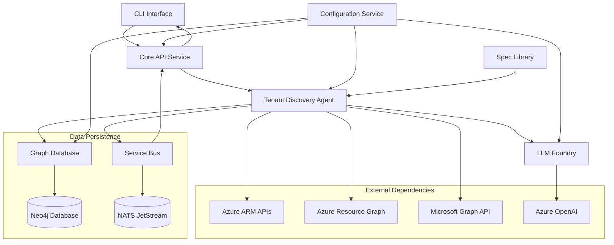

# Tenant Discovery MVP Implementation Blueprint

## Functional Overview

The Tenant Discovery MVP implements a comprehensive Azure tenant enumeration system that discovers all accessible resources, analyzes their relationships, stores them in a graph database, and generates detailed narrative documentation. This system serves as the foundation for SimBuilder's infrastructure simulation capabilities by providing accurate real-world Azure environment topologies.

### Core Capabilities
- **Comprehensive Azure Discovery**: Enumerate all accessible Azure resources using ARM APIs and Resource Graph queries
- **Graph Database Population**: Store discovered resources and relationships in Neo4j for complex querying and visualization
- **Intelligent Narrative Generation**: Use Azure OpenAI to generate human-readable documentation of discovered architectures
- **Real-time Progress Tracking**: Provide live updates on discovery progress via Service Bus messaging
- **Rate-Limited Operations**: Respect Azure API limits with intelligent throttling and retry mechanisms
- **Session-based Management**: Support concurrent discovery sessions with isolation and state management

## Service Boundaries & Module Structure

The implementation follows a modular architecture with clear service boundaries under the `src/` directory:

```
src/
├── simbuilder/
│   ├── __init__.py
│   ├── config/                           # Configuration Service (Phase 1)
│   │   ├── __init__.py
│   │   ├── config_manager.py            # Central configuration loading/validation
│   │   ├── environment.py               # Environment variable management
│   │   └── schemas.py                   # Configuration validation schemas
│   ├── graphdb/                         # Graph Database Service (Phase 2)
│   │   ├── __init__.py
│   │   ├── neo4j_connector.py          # Neo4j connection management
│   │   ├── schema.py                   # Graph schema definitions
│   │   ├── query_builder.py            # Cypher query construction
│   │   └── tenant_importer.py          # Tenant discovery import logic
│   ├── servicebus/                      # Service Bus (Phase 3)
│   │   ├── __init__.py
│   │   ├── client.py                   # NATS/Service Bus client
│   │   ├── topics.py                   # Topic definitions and routing
│   │   └── progress_notifier.py        # Discovery progress notifications
│   ├── spec_library/                    # Spec Library (Phase 4)
│   │   ├── __init__.py
│   │   ├── git_repository.py           # Git repository integration
│   │   ├── template_loader.py          # Liquid template loading
│   │   └── spec_validator.py           # Specification validation
│   ├── core_api/                        # Core API Service (Phase 5)
│   │   ├── __init__.py
│   │   ├── main.py                     # FastAPI application
│   │   ├── routers/
│   │   │   ├── __init__.py
│   │   │   ├── simulations.py          # Simulation management endpoints
│   │   │   ├── tenant_discovery.py     # Discovery session endpoints
│   │   │   └── health.py              # Health check endpoints
│   │   ├── models/
│   │   │   ├── __init__.py
│   │   │   ├── simulation.py           # Simulation data models
│   │   │   └── discovery.py           # Discovery session models
│   │   ├── auth/
│   │   │   ├── __init__.py
│   │   │   └── jwt_handler.py          # JWT authentication
│   │   └── middleware/
│   │       ├── __init__.py
│   │       ├── session_context.py      # Session ID handling
│   │       └── error_handler.py        # Global error handling
│   ├── llm_foundry/                     # LLM Foundry Integration (Phase 6)
│   │   ├── __init__.py
│   │   ├── llm_client.py               # Unified LLM client interface
│   │   ├── authenticator.py            # Azure OpenAI authentication
│   │   ├── model_router.py             # Model selection logic
│   │   └── usage_tracker.py            # Token usage and cost tracking
│   └── tenant_discovery/                # Tenant Discovery Agent (Phase 7)
│       ├── __init__.py
│       ├── agent.py                    # Main agent orchestration
│       ├── azure_client.py             # Azure API integration
│       ├── discovery_engine.py         # Resource enumeration logic
│       ├── relationship_analyzer.py    # Resource relationship mapping
│       ├── narrative_generator.py      # LLM-based documentation
│       ├── session_manager.py          # Discovery session lifecycle
│       ├── models/
│       │   ├── __init__.py
│       │   ├── discovery_session.py    # Session data models
│       │   ├── azure_resource.py       # Azure resource models
│       │   └── narrative.py           # Narrative documentation models
│       └── cli.py                      # CLI interface for discovery
├── prompts/                             # External Liquid Templates
│   └── tenant-discovery/
│       ├── architecture_summary.liquid  # Tenant overview generation
│       ├── resource_analysis.liquid     # Resource detail analysis
│       ├── relationship_mapping.liquid  # Relationship documentation
│       └── reproduction_guide.liquid    # Environment reproduction steps
└── tests/                               # Test Suites
    ├── unit/                           # Unit tests for each module
    ├── integration/                    # Integration tests with live services
    └── e2e/                           # End-to-end discovery scenarios
```

## Data Flow Architecture

The Tenant Discovery system follows an event-driven architecture with clear data flow patterns:



### Data Flow Sequence

1. **Session Initiation**: CLI → Core API → Tenant Discovery Agent
2. **Azure Authentication**: Agent → Azure Identity → ARM/Resource Graph APIs  
3. **Resource Discovery**: Agent → Azure APIs → Resource enumeration
4. **Relationship Analysis**: Agent → Internal analysis → Resource mapping
5. **Graph Population**: Agent → Graph Database → Neo4j storage
6. **Narrative Generation**: Agent → LLM Foundry → Azure OpenAI → Documentation
7. **Progress Updates**: Agent → Service Bus → Core API → CLI (real-time)

## External Dependencies & Mock Strategy

### Production Dependencies

| Dependency | Purpose | Mock Strategy |
|------------|---------|---------------|
| **Azure Resource Manager APIs** | Resource enumeration | Azure ARM emulator for unit tests; live Azure for integration |
| **Azure Resource Graph** | Cross-subscription queries | Mock GraphQL responses for unit tests; live for integration |
| **Microsoft Graph API** | Identity and permissions | Microsoft Graph SDK mocks; live AAD tenant for integration |
| **Azure OpenAI** | Narrative generation | Static response mocks for unit tests; live service for integration |
| **Neo4j Database** | Graph storage | Neo4j Testcontainers for all tests (no mocking) |
| **NATS JetStream** | Message bus | NATS Testcontainers for all tests (no mocking) |

### Azure SDK Integration

```python
# Example Azure client configuration
from azure.identity import DefaultAzureCredential
from azure.mgmt.resource import ResourceManagementClient
from azure.mgmt.resourcegraph import ResourceGraphClient

class AzureDiscoveryClient:
    def __init__(self, credential: DefaultAzureCredential):
        self.credential = credential
        self.resource_client = ResourceManagementClient(credential, subscription_id)
        self.graph_client = ResourceGraphClient(credential)
```

## Initial Public API Surface

### Tenant Discovery Agent API

```python
class TenantDiscoveryAgent:
    """Main orchestration class for tenant discovery operations."""
    
    def __init__(self, config: TenantDiscoveryConfig):
        self.config = config
        self.azure_client = AzureDiscoveryClient(config.credentials)
        self.graph_db = Neo4jConnector.from_config(config.graph_db)
        self.llm_client = LLMClient.get_instance()
        self.session_manager = DiscoverySessionManager()
    
    async def start_discovery(self, scope: DiscoveryScope) -> str:
        """Start new tenant discovery session."""
        
    async def get_session_status(self, session_id: str) -> DiscoveryStatus:
        """Get current discovery progress."""
        
    async def pause_discovery(self, session_id: str) -> bool:
        """Pause ongoing discovery with state preservation."""
        
    async def resume_discovery(self, session_id: str) -> bool:
        """Resume paused discovery session."""
        
    async def get_discovery_results(self, session_id: str) -> TenantDiscoveryExport:
        """Retrieve complete discovery results."""
        
    async def generate_narrative(self, session_id: str, detail_level: str) -> str:
        """Generate narrative documentation from discovered resources."""
```

### REST API Endpoints

```python
# FastAPI router for tenant discovery
@router.post("/tenant-discovery/sessions")
async def create_discovery_session(request: DiscoveryRequest) -> DiscoverySessionResponse:
    """Start new tenant discovery session."""

@router.get("/tenant-discovery/sessions/{session_id}/status")
async def get_discovery_status(session_id: str) -> DiscoveryStatusResponse:
    """Get current discovery progress and metrics."""

@router.get("/tenant-discovery/sessions/{session_id}/narrative")
async def get_discovery_narrative(
    session_id: str, 
    format: str = "markdown",
    detail_level: str = "detailed"
) -> NarrativeResponse:
    """Get generated narrative documentation."""
```

### CLI Interface

```bash
# Core discovery commands
simbuilder discover tenant --tenant-id <id> --output-format json
simbuilder discover status --session-id <id>
simbuilder discover narrative --session-id <id> --format markdown
simbuilder discover export --session-id <id> --format cypher
```

## Test Strategy

### Unit Test Coverage (Target: 90%+)

- **Azure Client Integration**: Mock Azure SDK responses, test error handling
- **Discovery Engine Logic**: Resource enumeration algorithms, filtering logic
- **Relationship Analysis**: Resource dependency mapping, graph construction
- **Narrative Generation**: Template rendering, LLM interaction mocking
- **Session Management**: State transitions, persistence, cleanup
- **Rate Limiting**: Throttling algorithms, backoff strategies

### Integration Test Strategy (Live Services Required)

Following the MVP's strict "no mocking" requirement for integration tests:

- **Live Azure Tenant**: Real tenant with known resource topology for validation
- **Neo4j Testcontainers**: Actual Neo4j instance for graph operations
- **NATS Testcontainers**: Real message bus for progress notifications
- **Live Azure OpenAI**: Actual LLM service for narrative generation
- **End-to-End Workflows**: Complete discovery cycles with validation

### Test Organization

```
tests/
├── unit/
│   ├── test_azure_client.py          # Azure SDK integration (mocked)
│   ├── test_discovery_engine.py      # Discovery logic (mocked Azure)
│   ├── test_relationship_analyzer.py # Relationship mapping (mocked data)
│   ├── test_narrative_generator.py   # LLM interaction (mocked)
│   └── test_session_manager.py       # Session lifecycle (mocked storage)
├── integration/
│   ├── test_live_azure_discovery.py  # Live Azure tenant discovery
│   ├── test_graph_population.py      # Neo4j integration (live)
│   ├── test_progress_notifications.py # Service Bus integration (live)
│   └── test_narrative_generation.py  # Azure OpenAI integration (live)
└── e2e/
    ├── test_complete_discovery.py    # Full discovery workflow
    ├── test_concurrent_sessions.py   # Multi-session scenarios
    └── test_large_tenant.py         # Performance with 1000+ resources
```

## Incremental Delivery Plan

### Phase 1: Configuration Service (Week 1)
**Goal**: Centralized configuration management foundation

**Deliverables**:
- [`ConfigManager`](src/simbuilder/config/config_manager.py:1) class with environment variable loading
- Configuration validation schemas using Pydantic
- Environment-specific configuration support (dev/test/prod)
- Unit tests for configuration loading and validation

**Acceptance Criteria**:
- All services can load configuration consistently
- Environment variables validated against schemas
- Configuration changes require no code updates

### Phase 2: Graph Database Service (Week 2)
**Goal**: Neo4j integration with Azure resource schema

**Deliverables**:
- [`Neo4jConnector`](src/simbuilder/graphdb/neo4j_connector.py:1) with connection pooling
- Azure resource graph schema definitions
- Tenant import functionality for discovery results
- Docker Compose setup with session-specific databases

**Acceptance Criteria**:
- Neo4j running in Docker with proper schema
- Resource import handling 10,000+ resources efficiently
- Session isolation preventing data mixing

### Phase 3: Service Bus Integration (Week 2)
**Goal**: NATS JetStream messaging for progress updates

**Deliverables**:
- [`ServiceBusClient`](src/simbuilder/servicebus/client.py:1) with topic management
- Progress notification system for discovery updates
- Docker Compose NATS setup with persistent streams
- Message schema definitions and validation

**Acceptance Criteria**:
- Real-time progress updates flowing through message bus
- Message delivery guarantees and error handling
- Topic isolation for concurrent discovery sessions

### Phase 4: Spec Library (Week 3)
**Goal**: External Liquid template management

**Deliverables**:
- Git repository integration for template storage
- [`TemplateLoader`](src/simbuilder/spec_library/template_loader.py:1) for runtime template loading
- Liquid template validation and syntax checking
- Baseline tenant discovery templates

**Acceptance Criteria**:
- All prompts loaded from external templates (zero hard-coded)
- Template syntax validation in CI/CD pipeline
- Version management for template updates

### Phase 5: Core API Service (Week 4)
**Goal**: FastAPI foundation with session management

**Deliverables**:
- FastAPI application with auto-generated OpenAPI docs
- Session-aware routing and middleware
- JWT authentication and authorization
- Health check endpoints and monitoring integration

**Acceptance Criteria**:
- API serving requests with sub-200ms response times
- Session context properly maintained across requests
- Comprehensive API documentation available

### Phase 6: LLM Foundry Integration (Week 5) ✅
**Goal**: Azure OpenAI integration for narrative generation

**Status**: Complete - Shared Azure OpenAI client and prompt rendering system

**Deliverables**:
- [`AzureOpenAIClient`](src/simbuilder_llm/client.py:1) with async support and retry logic
- Liquid template-based prompt system with variable validation
- CLI interface for chat completions and embeddings (`sbcli llm ...`)
- Comprehensive error handling with custom exceptions
- Full test coverage (90%+) with mocked OpenAI interactions

**Implementation Highlights**:
- **Async Azure OpenAI Client**: Supports both chat completions and embeddings with exponential backoff retry
- **Prompt Template System**: Liquid templates with variable validation and caching
- **CLI Integration**: Commands for `chat`, `embed`, `info`, and `check` operations
- **Configuration Integration**: Extends scaffolding config with Azure OpenAI settings
- **Error Handling**: Custom `LLMError` and `PromptRenderError` exceptions
- **Security**: API key masking in logs and repr methods

**Acceptance Criteria**: ✅
- Text generation working with rate limiting
- Prompt template system with variable validation
- CLI interface integrated with scaffolding commands
- Comprehensive test coverage with pure unit tests

### Phase 7: Tenant Discovery Agent (Weeks 6-7)
**Goal**: Complete Azure tenant enumeration capability

**Deliverables**:
- [`TenantDiscoveryAgent`](src/simbuilder/tenant_discovery/agent.py:1) with full Azure integration
- Resource enumeration using ARM and Resource Graph APIs
- Relationship analysis and graph population
- Narrative documentation generation
- CLI interface for discovery operations

**Acceptance Criteria**:
- Complete tenant discovery within 30 minutes
- 99%+ resource discovery accuracy
- Narrative documentation sufficient for reproduction
- Rate limiting respecting Azure API limits

### Phase 8: Integration & E2E Testing (Week 8)
**Goal**: Comprehensive testing with live services

**Deliverables**:
- Integration test suite with live Azure/Neo4j/NATS
- End-to-end discovery scenarios with validation
- Performance testing with large tenant datasets
- Error condition testing and recovery validation

**Acceptance Criteria**:
- All integration tests passing with live services
- E2E discovery completing successfully
- Performance benchmarks meeting requirements
- Error recovery functioning properly

### Phase 9: Deployment & Documentation (Week 9)
**Goal**: Production-ready deployment

**Deliverables**:
- Docker Compose orchestration for full stack
- Environment setup automation scripts
- Comprehensive deployment documentation
- Operational runbooks and troubleshooting guides

**Acceptance Criteria**:
- Single-command local environment setup
- Documentation enabling developer onboarding
- Operational procedures for production deployment

## Key Architectural Decisions

### 1. Shared Virtual Environment
All components utilize a single virtual environment at the repository root (`.venv`) to ensure dependency consistency and simplify development workflows.

### 2. Session-Aware Architecture
Every component supports session-specific configuration enabling multiple concurrent SimBuilder instances without conflicts.

### 3. External Template System
All LLM prompts are externalized to Liquid templates under `prompts/tenant-discovery/` directory, enabling prompt evolution without code changes.

### 4. Live Service Integration Testing
Integration tests use real services (Neo4j, NATS, Azure APIs) rather than mocks to ensure realistic validation of system behavior.

### 5. Event-Driven Progress Updates
Discovery progress is communicated through Service Bus messaging, enabling real-time updates to multiple consumers.

### 6. Rate-Limited Azure Integration
Built-in rate limiting and exponential backoff ensure respectful Azure API consumption and handle throttling gracefully.

## Risk Mitigation Strategies

### Technical Risks

| Risk | Mitigation Strategy |
|------|-------------------|
| **Azure API Rate Limits** | Conservative rate limiting (10 req/sec), exponential backoff, request queuing |
| **Large Tenant Performance** | Streaming discovery, incremental processing, progress checkpointing |
| **LLM Cost Control** | Token budgeting, caching strategies, template optimization |
| **Graph Database Scaling** | Batch imports, indexed queries, connection pooling |
| **Session State Management** | Persistent session storage, recovery mechanisms, cleanup automation |

### Operational Risks

| Risk | Mitigation Strategy |
|------|-------------------|
| **Service Dependencies** | Health checks, circuit breakers, graceful degradation |
| **Authentication Failures** | Token refresh, fallback credentials, error recovery |
| **Network Connectivity** | Retry logic, timeout handling, offline mode detection |
| **Resource Cleanup** | Automated cleanup jobs, TTL enforcement, manual override |

## Success Metrics

### Performance Targets
- **Discovery Completion**: 30 minutes for 1000+ resource tenant
- **API Response Times**: Sub-200ms for standard operations
- **Graph Query Performance**: Sub-50ms for visualization queries
- **Memory Usage**: <4GB for typical discovery session

### Quality Targets  
- **Resource Discovery Accuracy**: 99%+ of accessible resources
- **Relationship Mapping Accuracy**: 95%+ correct dependencies
- **Narrative Documentation Quality**: 90%+ reproduction accuracy
- **Test Coverage**: 90%+ unit test coverage, 100% integration coverage

### Operational Targets
- **System Availability**: 99.9% uptime during discovery operations
- **Error Recovery**: Automatic recovery from transient failures
- **Resource Cleanup**: 100% cleanup success rate
- **Session Isolation**: Zero cross-session data contamination

This implementation blueprint provides a comprehensive foundation for building the Tenant Discovery MVP with clear architectural boundaries, robust testing strategies, and realistic delivery milestones. The modular design enables parallel development while maintaining clear integration points and data contracts between components.