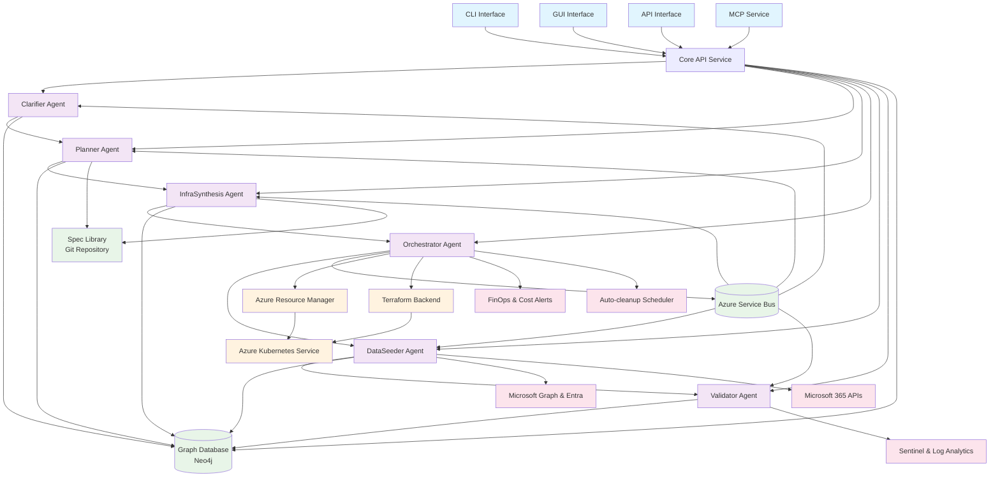
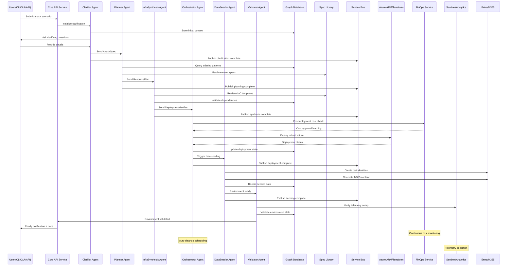
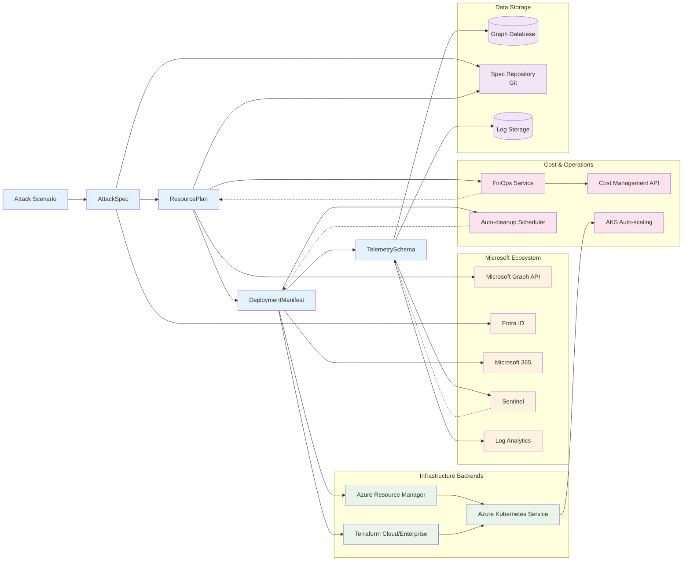

# SimBuilder Design

## 1 Architecture Overview

SimBuilder employs a distributed multi-agent architecture that separates concerns of planning, generation, orchestration, seeding, and validation.  Users drive the system from a CLI, Simple GUI, or MCP service. Agents communicate asynchronously over an Azure Service Bus topic and persist state in a shared metadata store. The design emphasises stateless execution for horizontal scalability on Azure Kubernetes Service (AKS), but in its primary form can all be run locally on a developer desktop. 

### Design Elements

* API service implements all functionality, CLI, GUI, MCP all talk to the API
* MVP Emphasis on ease of use for the developer building and trying the system locally
* Autogen Core (@https://microsoft.github.io/autogen/stable/ ) for agents framework
* AI Agents leverage knowledge frm Microsoft Learn and other sources to be experts in Azure automation
* Azure OpenAI for LLM
* Neo4J for database
* FASTAPI api service
* Rich CLI client
* React + typescript GUI client
* MCP service in front of API
* forcegraph3d for visualization of the graph database
* knowledge graph of relevant MS Learn artcles/content on azure services that the AI agents use in order to model "expertise" in Azure. 

_Figure&nbsp;1: Complete SimBuilder Architecture_



## 2 Agent Responsibilities

| Agent | Responsibility |
|-------|---------------|
| **PlannerAgent** | Convert high-level attack spec into concrete `ResourcePlan`. |
| **InfraSynthesisAgent** | Transform plan into IaC `DeploymentManifest`. |
| **DataSeeder** | Generate synthetic identities, mail, files, and logs. |
| **Validator** | Ensure deployed state matches prerequisites & telemetry expectations. |
| **Orchestrator** | Coordinate workflow via message bus and persist state. |

_Figure&nbsp;2: Complete MVP Flow Sequence_




_Figure&nbsp;3: Data Flow and Integration Architecture_



## 4 Data Model

The system transforms user input through a series of structured data objects:

```text
AttackSpec → ResourcePlan → DeploymentManifests → TelemetrySchema → GraphDB representation
```

### Core Data Objects:
- **AttackSpec**: Structured representation of user's attack scenario requirements
- **ResourcePlan**: Concrete Azure resources and configurations needed
- **DeploymentManifest**: Infrastructure-as-Code templates and deployment scripts
- **TelemetrySchema**: Expected logs, metrics, and monitoring configurations
- **GraphDB Node**: Persistent representation linking all components and relationships

## 5 Integration Points

- Microsoft Graph & Entra ID for tenant and identity operations.  
- Azure Resource Manager or Terraform for infrastructure deployment.  
- Microsoft 365 APIs for workload data.  
- Sentinel & Log Analytics for telemetry collection.  

## 6 Testing & Governance

- **Unit & contract tests** executed per micro-service in isolated sandbox.  
- **Canary environments** validated nightly with representative attack library.  
- **Policy guardrails** (Azure Policy, Defender for Cloud) enforced pre-merge.  

