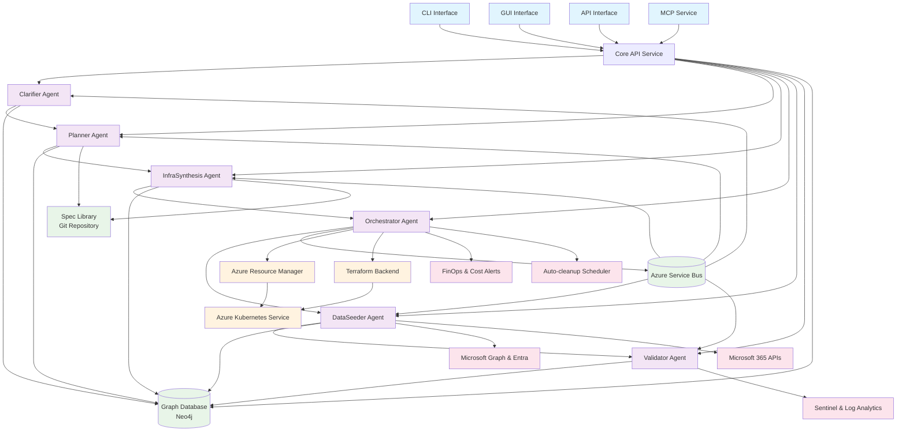
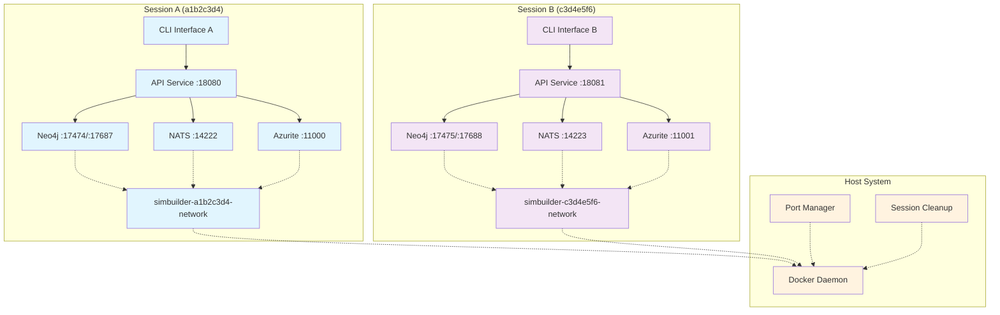
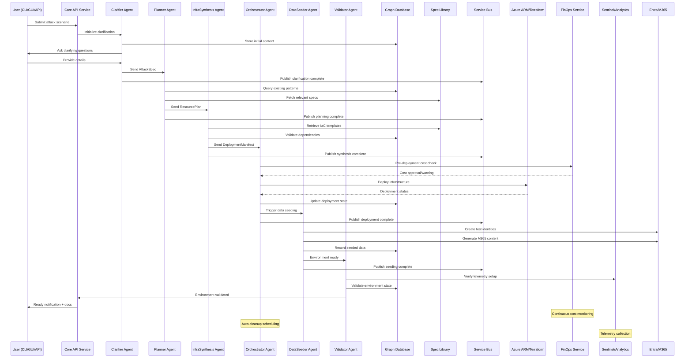
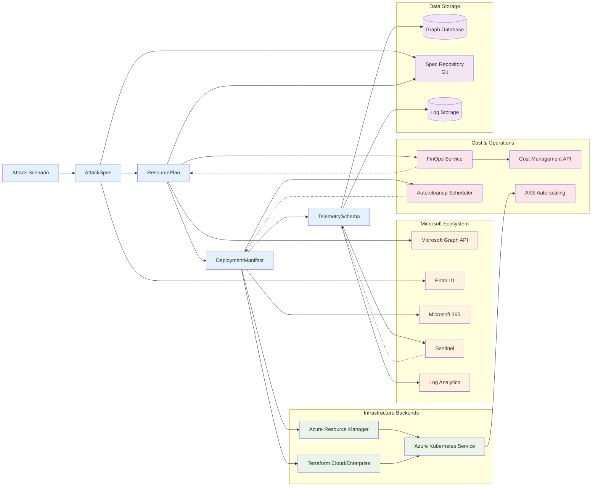

# SimBuilder Design

## 1 Architecture Overview

SimBuilder employs a distributed multi-agent architecture that separates concerns of planning,
generation, orchestration, seeding, and validation. Users drive the system from a CLI, Simple GUI,
or MCP service. Agents communicate asynchronously over an Azure Service Bus topic and persist state
in a shared metadata store. The design emphasises stateless execution for horizontal scalability on
Azure Kubernetes Service (AKS), but in its primary form can all be run locally on a developer
desktop.

**Session Isolation**: SimBuilder supports concurrent execution through global session IDs and
dynamic port allocation, enabling multiple instances to run simultaneously without conflicts (e.g.,
in GitHub Codespaces or Docker-in-Docker setups).

### Design Elements

- Project scaffolding - setup of the project with a top level README, uv and poe configuration,
  github actions configuration, .gitignore, and any other cross-project setup required by all
  modules.
- API service implements all functionality, CLI, GUI, MCP all talk to the API
- MVP Emphasis on ease of use for the developer building and trying the system locally
- Autogen Core (@https://microsoft.github.io/autogen/stable/ ) for agents framework
- AI Agents leverage knowledge frm Microsoft Learn and other sources to be experts in Azure
  automation
- Azure OpenAI for LLM
- Neo4J for database
- FASTAPI api service
- Rich CLI client
- React + typescript GUI client
- MCP service in front of API
- forcegraph3d for visualization of the graph database
- knowledge graph of relevant MS Learn artcles/content on azure services that the AI agents use in
  order to model "expertise" in Azure.

_Figure 1: Complete SimBuilder Architecture_



## 2 Session Isolation and Multi-Instance Support

SimBuilder implements a comprehensive session isolation system that enables multiple instances to
run concurrently without resource conflicts. This capability is essential for multi-user
environments, CI/CD pipelines, and cloud development platforms like GitHub Codespaces.

### 2.1 Session ID Management

#### Session ID Generation

- **Generation Method**: UUIDv4 generated at startup by the scaffolding layer
- **Format**: `a1b2c3d4-e5f6-7890-abcd-ef1234567890` (standard UUID format)
- **Storage**: Persisted in environment variables and session files
- **Scope**: Applied to all containers, networks, and resources within a session

#### Environment Variable Strategy

```bash
# Core session identification
SIMBUILDER_SESSION_ID=a1b2c3d4-e5f6-7890-abcd-ef1234567890
COMPOSE_PROJECT_NAME=simbuilder-a1b2c3d4

# Session-specific connection endpoints
NEO4J_URI=bolt://localhost:17687
NEO4J_HTTP_URI=http://localhost:17474
NATS_URL=nats://localhost:14222
AZURITE_BLOB_URI=http://localhost:11000
```

### 2.2 Dynamic Port Allocation

#### Port Management Strategy

- **Allocation Method**: Runtime port scanning for available ports in predefined ranges
- **Conflict Resolution**: Automatic increment and retry if port is occupied
- **Persistence**: Allocated ports stored in session environment file
- **Cleanup**: Automatic port release on session termination

#### Default Port Ranges

```yaml
Graph Database (Neo4j):
  HTTP: 17000-17999
  Bolt: 17000-17999

Message Bus (NATS):
  Client: 14000-14999
  HTTP: 14000-14999

Storage (Azurite):
  Blob: 11000-11999
  Queue: 11000-11999
  Table: 11000-11999

API Services:
  Gateway: 18000-18999
  Core API: 18000-18999
```

### 2.3 Container and Resource Naming

#### Naming Convention

- **Pattern**: `<original_name>-<session_id_short>`
- **Session ID Short**: First 8 characters of the UUID
- **Examples**:
  - `simbuilder-neo4j-a1b2c3d4`
  - `simbuilder-nats-a1b2c3d4`
  - `simbuilder-api-a1b2c3d4`

#### Network Isolation

```yaml
# Session-specific networks
networks:
  simbuilder-a1b2c3d4-network:
    name: simbuilder-a1b2c3d4-network
    driver: bridge

# Session-specific volumes
volumes:
  neo4j_data_a1b2c3d4:
    driver: local
  nats_data_a1b2c3d4:
    driver: local
```

### 2.4 Docker-in-Docker Support

#### Requirements

- **Socket Mounting**: `/var/run/docker.sock` mounted into dev containers
- **Docker Client**: Docker CLI available within development environment
- **Network Access**: Container-to-container communication enabled
- **Resource Limits**: Respect host system resource constraints

#### GitHub Codespaces Integration

```json
{
  "name": "SimBuilder Dev Environment",
  "dockerFile": "../docker/dev.Dockerfile",
  "mounts": [
    "source=/var/run/docker.sock,target=/var/run/docker.sock,type=bind"
  ],
  "features": {
    "ghcr.io/devcontainers/features/docker-in-docker:2": {}
  },
  "forwardPorts": [
    "17474", "17687", "14222", "18080"
  ],
  "portsAttributes": {
    "17474": {"label": "Neo4j Browser"},
    "17687": {"label": "Neo4j Bolt"},
    "14222": {"label": "NATS Client"},
    "18080": {"label": "API Gateway"}
  }
}
```

### 2.5 Session-Isolated Architecture Diagram



## 3 Agent Responsibilities

| Agent                   | Responsibility                                                        |
| ----------------------- | --------------------------------------------------------------------- |
| **PlannerAgent**        | Convert high-level attack spec into concrete `ResourcePlan`.          |
| **InfraSynthesisAgent** | Transform plan into IaC `DeploymentManifest`.                         |
| **DataSeeder**          | Generate synthetic identities, mail, files, and logs.                 |
| **Validator**           | Ensure deployed state matches prerequisites & telemetry expectations. |
| **Orchestrator**        | Coordinate workflow via message bus and persist state.                |

_Figure 2: Complete MVP Flow Sequence_



_Figure 3: Data Flow and Integration Architecture_



## 4 Data Model

The system transforms user input through a series of structured data objects:

```text
AttackSpec → ResourcePlan → DeploymentManifests → TelemetrySchema → GraphDB representation
```

### Core Data Objects:

- **AttackSpec**: Structured representation of user's attack scenario requirements
- **ResourcePlan**: Concrete Azure resources and configurations needed
- **DeploymentManifest**: Infrastructure-as-Code templates and deployment scripts
- **TelemetrySchema**: Expected logs, metrics, and monitoring configurations
- **GraphDB Node**: Persistent representation linking all components and relationships

## 5 Integration Points

- Microsoft Graph & Entra ID for tenant and identity operations.
- Azure Resource Manager or Terraform for infrastructure deployment.
- Microsoft 365 APIs for workload data.
- Sentinel & Log Analytics for telemetry collection.

## 6 Prompt Templating Strategy

SimBuilder adopts **Liquid** as the standard templating engine for all LLM prompts across AI agents.
This design decision ensures consistency, maintainability, and language-agnostic template
management.

### 6.1 Template Engine Selection: Liquid

**Rationale**: After evaluation against Prompty and other alternatives, Liquid was chosen for:

- **Language agnostic**: Works across Python, TypeScript, and other runtimes
- **Mature ecosystem**: Widely adopted with robust tooling support
- **Simplicity**: Clean syntax without complex programming constructs
- **OSS integration**: Already used by several open-source prompt management tools
- **Rendering consistency**: Identical output across different language implementations

### 6.2 Directory Structure

All prompt templates are stored under the `prompts/` directory with agent-specific subdirectories:

```
prompts/
├── clarifier/
│   ├── initial_questions.liquid
│   ├── follow_up_questions.liquid
│   └── spec_generation.liquid
├── planner/
│   ├── resource_analysis.liquid
│   ├── plan_generation.liquid
│   └── cost_estimation.liquid
├── infrasynthesis/
│   ├── terraform_generation.liquid
│   ├── bicep_generation.liquid
│   └── arm_generation.liquid
├── orchestrator/
│   ├── deployment_orchestration.liquid
│   └── status_updates.liquid
├── dataseeder/
│   ├── identity_generation.liquid
│   ├── data_population.liquid
│   └── relationship_mapping.liquid
├── validator/
│   ├── environment_validation.liquid
│   ├── prerequisite_check.liquid
│   └── telemetry_verification.liquid
└── tenant-discovery/
    ├── enumeration_analysis.liquid
    ├── graph_population.liquid
    └── narrative_generation.liquid
```

### 6.3 Template Loading and Runtime Requirements

**Mandatory Implementation Standards**:

- All agents MUST load prompts from external `.liquid` files at runtime
- Hard-coded prompts within source code are STRICTLY FORBIDDEN
- Template loading failures MUST cause agent initialization to fail gracefully
- All template variables MUST be validated before rendering
- Rendered prompts SHOULD be logged (with sensitive data redacted) for debugging

### 6.4 CI/CD Integration and Linting

**Template Quality Assurance**:

- Pre-commit hooks MUST validate Liquid syntax across all template files
- CI pipeline MUST include prompt template linting using liquid-linter or equivalent
- Template variable reference validation MUST be enforced (no undefined variables)
- Template output length validation SHOULD be included to prevent token limit issues

**Example lint configuration**:

```yaml
# .github/workflows/prompt-validation.yml
- name: Validate Liquid Templates
  run: |
    find prompts/ -name "*.liquid" -exec liquid-lint {} \;
    python scripts/validate_template_variables.py
```

### 6.5 Template Variable Guidelines

**Consistency Standards**:

- Use `snake_case` for all template variables
- Prefix context-specific variables (e.g., `attack_spec_`, `resource_plan_`)
- Include variable documentation in template headers as Liquid comments
- Provide default values for optional variables using Liquid conditionals

**Example template structure**:

```liquid

Template: clarifier/initial_questions.liquid
Variables:
  - attack_description (required): User's initial attack scenario description
  - user_experience_level (optional): beginner|intermediate|expert, default: intermediate
  - max_questions (optional): Maximum questions to ask, default: 5


Based on your attack scenario: "{{ attack_description }}"




I need to gather additional details to create a comprehensive simulation...
```

## 7 Implementation Order

Based on component dependencies analysis, the following implementation order ensures that all
dependencies are satisfied before dependent components are built:

| Order | Component                         | Depends On                                                                                                          |
| ----: | --------------------------------- | ------------------------------------------------------------------------------------------------------------------- |
|     1 | Configuration Service             | –                                                                                                                   |
|     2 | LLM Foundry Integration           | Configuration Service                                                                                               |
|     3 | Graph Database Service            | Configuration Service                                                                                               |
|     4 | Service Bus                       | Configuration Service                                                                                               |
|     5 | Spec Library                      | Configuration Service                                                                                               |
|     6 | Core API Service                  | Configuration Service, Graph Database Service, Service Bus, Spec Library                                            |
|     7 | Clarifier Agent                   | Configuration Service, LLM Foundry Integration, Core API Service, Graph Database Service, Service Bus, Spec Library |
|     8 | Planner Agent                     | Configuration Service, LLM Foundry Integration, Core API Service, Graph Database Service, Service Bus, Spec Library |
|     9 | InfraSynthesis Agent              | Configuration Service, LLM Foundry Integration, Core API Service, Graph Database Service, Service Bus, Spec Library |
|    10 | Orchestrator Agent                | Configuration Service, LLM Foundry Integration, Core API Service, Graph Database Service, Service Bus, Spec Library |
|    11 | DataSeeder Agent                  | Configuration Service, LLM Foundry Integration, Core API Service, Graph Database Service, Service Bus, Spec Library |
|    12 | Validator Agent                   | Configuration Service, LLM Foundry Integration, Core API Service, Graph Database Service, Service Bus, Spec Library |
|    13 | Tenant Discovery Agent            | Configuration Service, LLM Foundry Integration, Core API Service, Graph Database Service, Service Bus, Spec Library |
|    14 | Microsoft Graph Entra Integration | Configuration Service, Core API Service, Graph Database Service, Service Bus                                        |
|    15 | Microsoft 365 Integration         | Configuration Service, Core API Service, Graph Database Service, Service Bus                                        |
|    16 | Terraform Runner                  | Configuration Service, Core API Service, Graph Database Service, Service Bus                                        |
|    17 | ARM Bicep Runner                  | Configuration Service, Core API Service, Graph Database Service, Service Bus                                        |
|    18 | Sentinel Analytics Integration    | Configuration Service, Core API Service, Graph Database Service, Service Bus                                        |
|    19 | FinOps Alerting                   | Configuration Service, Core API Service, Graph Database Service, Service Bus                                        |
|    20 | Auto Cleanup Scheduler            | Configuration Service, Core API Service, Graph Database Service, Service Bus                                        |
|    21 | AKS Autoscaler Manager            | Configuration Service, Core API Service, Graph Database Service, Service Bus                                        |
|    22 | REST API Gateway                  | Configuration Service, Core API Service, Graph Database Service, Service Bus                                        |
|    23 | CLI Interface                     | Configuration Service, Core API Service                                                                             |
|    24 | GUI Interface                     | Configuration Service, Core API Service                                                                             |
|    25 | MCP Service                       | Configuration Service, Core API Service                                                                             |
|    26 | Project Scaffolding               | All component repositories                                                                                          |

**Notes:**

- No circular dependencies detected in the component dependency graph
- Components 7-13 (AI Agents) can be implemented in parallel after their dependencies are complete
- Components 14-22 (Integration Services) can be implemented in parallel after their dependencies
  are complete
- Components 23-25 (User Interfaces) can be implemented in parallel after Core API Service is
  complete
- Project Scaffolding should be implemented last as it depends on all other component repositories
  being established

## 8 Testing & Governance

- **Unit & contract tests** executed per micro-service in isolated sandbox.
- **Canary environments** validated nightly with representative attack library.
- **Policy guardrails** (Azure Policy, Defender for Cloud) enforced pre-merge.
