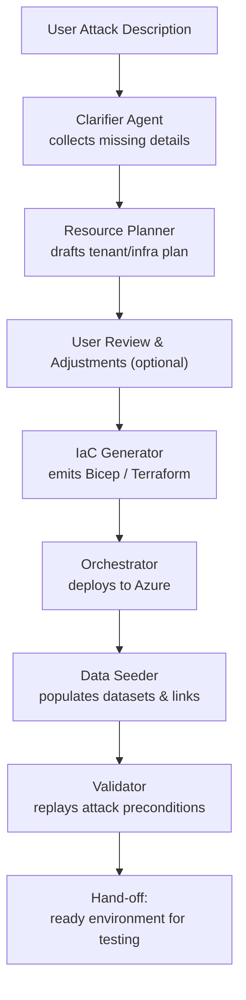

# SimBuilder Overview

## 1  Purpose & Scope

SimBuilder automates the planning, provisioning, and clean-up of **enterprise-grade cloud simulation environments** purpose-built to **replay sophisticated cyber-attacks at scale**. Security researchers, red teams, and product engineers can obtain an isolated Azure tenant, populated identities, realistic data, and the telemetry wiring needed to measure detection quality – all with a single prompt. Alternately to submitting an attack, the user may also start with a description of an environment.

### 1.1 Key Functional Capabilities
- **CLI, API, Simple GUI app, and MCP service**, all runnable locally in dev env, can be easily run after a simple checkout. Entire project can run on a developer's laptop, creating simulation resource in the cloud. 
- Starts with basic input of a file containing the attack description or the environment.
- **Interactive requirements capture** through incremental clarifying questions. Once enough information is captured, an overview markdown document is produced holding all the details.  As needed, additional markdown specifications can be created for each element of the simulation. The set of specifications thus generated end up being stored in a simulation library in this git repo. 
- **AI-driven resource planning** of tenants, identities, networks, workloads, and datasets.  
- **Generation of IaC artifacts** such as Bicep, Terraform, or ARM templates with built-in rollback.  
- **Orchestration of Deployment** Once artifacts are generated, deployment can be orchestrated or adjustments can be made to the specifications and the artifacts regenerated. 
- **Data seeding** that establishes cross-tenant and cross-workload relationships to mirror real production graphs.  
- **Precondition validation** ensuring the environment can support the attack sequence and collect all relevant telemetry.  
- **Dashboard/Management CLI/UI/MCP** of the sets of environments that have been produced, provisioned, etc
- **Graph Database Mapping / Documenting** each simulation environment with ability to output graph viz from the cli, to query the graph with mcp, and to view/browse via the GUI (and can be used to regenerate sim from scratch)
- **Versioning and repeatability** via Git-based manifests, with automated clean-up and **cost control** tags.  

### 1.2 End-to-End Flow

### 1.3 Non-Functional Requirements
| Quality Attribute | Target |
|-------------------|--------|
| Security | Principle of least privilege, encrypted secrets, RBAC audit logs |
| Scalability | Support 10+ concurrent full-scale simulations |
| Auditability | Immutable build artifacts, signed releases, provenance tracking |
| Extensibility | Plugin architecture for new cloud providers, cloud features, IAC providers, or attack patterns |
| Cost Governance | Budget caps, TTL auto-teardown, FinOps alerting at 80 % spend |
| Accessibility | Web UI meets WCAG 2.1 AA & keyboard-only navigation |

## 2  MVP

* Single tenant per sim 
* Sim Builder API, used by CLI, GUI, MCP service
* Sim Env Graph Database
* Input-> Attack Description -> Sim Specifications in a repo -> IaC code for Sim -> Orchestration of deployment -> GraphDB documents Sim (and can be used to recreate it)
* Ability to set/enforce budget / consumption limits
* Ability to cleanup/reset environments

## 3  Acceptance Criteria
