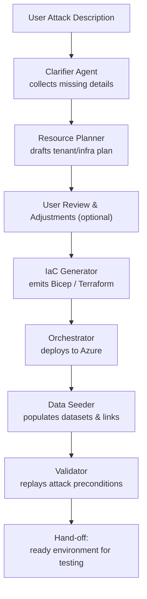

# SimBuilder Overview

## 1  Purpose & Scope

SimBuilder automates the planning, provisioning, and clean-up of **enterprise-grade cloud simulation
environments** purpose-built to **replay sophisticated cyber-attacks at scale**. Security
researchers, red teams, and product engineers can obtain an isolated Azure tenant, populated
identities, realistic data, and the telemetry wiring needed to measure detection quality – all with
a single prompt. Alternately to submitting an attack, the user may also start with a description of
an environment.

### 1.1 Key Functional Capabilities

- **CLI, API, Simple GUI app, and MCP service**, all runnable locally in dev env, can be easily run
  after a simple checkout. Entire project can run on a developer's laptop, creating simulation
  resource in the cloud.
- Starts with basic input of a file containing the attack description or the environment.
- **Interactive requirements capture** through incremental clarifying questions. Once enough
  information is captured, an overview markdown document is produced holding all the details. As
  needed, additional markdown specifications can be created for each element of the simulation. The
  set of specifications thus generated end up being stored in a simulation library in this git repo.
- **AI-driven resource planning** of tenants, identities, networks, workloads, and datasets.
- **Generation of IaC artifacts** such as Bicep, Terraform, or ARM templates with built-in rollback.
- **Orchestration of Deployment** Once artifacts are generated, deployment can be orchestrated or
  adjustments can be made to the specifications and the artifacts regenerated.
- **Data seeding** that establishes cross-tenant and cross-workload relationships to mirror real
  production graphs.
- **Precondition validation** ensuring the environment can support the attack sequence and collect
  all relevant telemetry.
- **Dashboard/Management CLI/UI/MCP** of the sets of environments that have been produced,
  provisioned, etc
- **Graph Database Mapping / Documenting** each simulation environment with ability to output graph
  viz from the cli, to query the graph with mcp, and to view/browse via the GUI (and can be used to
  regenerate sim from scratch)
- **Versioning and repeatability** via Git-based manifests, with automated clean-up and **cost
  control** tags.

### 1.2 End-to-End Flow



### 1.3 Non-Functional Requirements

| Quality Attribute | Target                                                                                         |
| ----------------- | ---------------------------------------------------------------------------------------------- |
| Security          | Principle of least privilege, encrypted secrets, RBAC audit logs                               |
| Scalability       | Support 10+ concurrent full-scale simulations                                                  |
| Auditability      | Immutable build artifacts, signed releases, provenance tracking                                |
| Extensibility     | Plugin architecture for new cloud providers, cloud features, IAC providers, or attack patterns |
| Cost Governance   | Budget caps, TTL auto-teardown, FinOps alerting at 80 % spend                                  |
| Accessibility     | Web UI meets WCAG 2.1 AA & keyboard-only navigation                                            |

## 2  MVP

- Single tenant per sim
- Sim Builder API, used by CLI, GUI, MCP service
- Sim Env Graph Database
- Input-> Attack Description -> Sim Specifications in a repo -> IaC code for Sim -> Orchestration of
  deployment -> GraphDB documents Sim (and can be used to recreate it)
- Ability to set/enforce budget / consumption limits
- Ability to cleanup/reset environments

## 3  Component Specifications

The SimBuilder architecture is implemented through a modular component system with clearly defined
interfaces and dependencies. Each component can be implemented independently following its detailed
specification.

| Component                         | Description                                                                            | Spec Link                                                                                                                                                                          |
| --------------------------------- | -------------------------------------------------------------------------------------- | ---------------------------------------------------------------------------------------------------------------------------------------------------------------------------------- |
| Project Scaffolding               | Repo bootstrap: tooling, lint, CI, dev-container                                       | [specs/components/00-scaffolding/scaffolding.md](components/00-scaffolding/scaffolding.md)                                                                                         |
| Graph Database Service            | Neo4j-based central data store for simulation metadata and relationships               | [specs/components/01-graph-database-service/graph-database-service.md](components/01-graph-database-service/graph-database-service.md)                                             |
| Service Bus                       | Azure Service Bus for asynchronous agent communication and workflow coordination       | [specs/components/02-service-bus/service-bus.md](components/02-service-bus/service-bus.md)                                                                                         |
| Spec Library                      | Git-based version control for simulation specifications and templates                  | [specs/components/03-spec-library/spec-library.md](components/03-spec-library/spec-library.md)                                                                                     |
| Core API Service                  | FastAPI-based central orchestration and REST API service                               | [specs/components/04-core-api-service/core-api-service.md](components/04-core-api-service/core-api-service.md)                                                                     |
| Clarifier Agent                   | AI agent for interactive requirements gathering and attack specification               | [specs/components/05-clarifier-agent/clarifier-agent.md](components/05-clarifier-agent/clarifier-agent.md)                                                                         |
| Planner Agent                     | AI agent for resource planning and infrastructure design                               | [specs/components/06-planner-agent/planner-agent.md](components/06-planner-agent/planner-agent.md)                                                                                 |
| InfraSynthesis Agent              | AI agent for IaC template generation (Terraform, Bicep, ARM)                           | [specs/components/07-infrasynthesis-agent/infrasynthesis-agent.md](components/07-infrasynthesis-agent/infrasynthesis-agent.md)                                                     |
| Orchestrator Agent                | Deployment coordination and workflow management                                        | [specs/components/08-orchestrator-agent/orchestrator-agent.md](components/08-orchestrator-agent/orchestrator-agent.md)                                                             |
| DataSeeder Agent                  | Synthetic data generation and environment population                                   | [specs/components/09-dataseeder-agent/dataseeder-agent.md](components/09-dataseeder-agent/dataseeder-agent.md)                                                                     |
| Validator Agent                   | Environment validation and readiness verification                                      | [specs/components/10-validator-agent/validator-agent.md](components/10-validator-agent/validator-agent.md)                                                                         |
| Microsoft Graph/Entra Integration | Identity management and Azure AD integration                                           | [specs/components/11-microsoft-graph-entra-integration/microsoft-graph-entra-integration.md](components/11-microsoft-graph-entra-integration/microsoft-graph-entra-integration.md) |
| Microsoft 365 Integration         | M365 environment population and data generation                                        | [specs/components/12-microsoft-365-integration/microsoft-365-integration.md](components/12-microsoft-365-integration/microsoft-365-integration.md)                                 |
| Terraform Runner                  | Terraform execution and state management                                               | [specs/components/13-terraform-runner/terraform-runner.md](components/13-terraform-runner/terraform-runner.md)                                                                     |
| ARM/Bicep Runner                  | Azure Resource Manager and Bicep template execution                                    | [specs/components/14-arm-bicep-runner/arm-bicep-runner.md](components/14-arm-bicep-runner/arm-bicep-runner.md)                                                                     |
| Sentinel Analytics Integration    | Azure Sentinel and Log Analytics integration                                           | [specs/components/15-sentinel-analytics-integration/sentinel-analytics-integration.md](components/15-sentinel-analytics-integration/sentinel-analytics-integration.md)             |
| FinOps Alerting                   | Cost monitoring, budget enforcement, and financial governance                          | [specs/components/16-finops-alerting/finops-alerting.md](components/16-finops-alerting/finops-alerting.md)                                                                         |
| Auto-Cleanup Scheduler            | Automated resource cleanup and TTL management                                          | [specs/components/17-auto-cleanup-scheduler/auto-cleanup-scheduler.md](components/17-auto-cleanup-scheduler/auto-cleanup-scheduler.md)                                             |
| AKS Autoscaler Manager            | Kubernetes autoscaling and resource optimization                                       | [specs/components/18-aks-autoscaler-manager/aks-autoscaler-manager.md](components/18-aks-autoscaler-manager/aks-autoscaler-manager.md)                                             |
| CLI Interface                     | Rich command-line interface for simulation management                                  | [specs/components/19-cli-interface/cli-interface.md](components/19-cli-interface/cli-interface.md)                                                                                 |
| GUI Interface                     | React-based web interface with graph visualization                                     | [specs/components/20-gui-interface/gui-interface.md](components/20-gui-interface/gui-interface.md)                                                                                 |
| REST API Gateway                  | External API gateway for third-party integrations                                      | [specs/components/21-rest-api-gateway/rest-api-gateway.md](components/21-rest-api-gateway/rest-api-gateway.md)                                                                     |
| MCP Service                       | Model Context Protocol service for AI assistant integration                            | [specs/components/22-mcp-service/mcp-service.md](components/22-mcp-service/mcp-service.md)                                                                                         |
| Tenant Discovery Agent            | Azure tenant resource enumeration and Neo4j graph population with narrative generation | [specs/components/23-tenant-discovery-agent/tenant-discovery-agent.md](components/23-tenant-discovery-agent/tenant-discovery-agent.md)                                             |

## 4  Project Build & Run Instructions

### Prerequisites

- Python 3.11+
- Node.js 18+
- Docker Desktop
- Azure CLI
- Git

### Environment Setup

```bash
# Clone the repository
git clone https://github.com/your-org/simbuilder
cd simbuilder

# Set environment variables
export AZURE_TENANT_ID="your-tenant-id"
export AZURE_CLIENT_ID="your-client-id"
export AZURE_CLIENT_SECRET="your-client-secret"
export OPENAI_API_KEY="your-openai-key"

# Copy configuration template
cp .env.example .env
# Edit .env with your specific configuration
```

### Local Development

```bash
# Start infrastructure services
docker-compose up -d neo4j redis

# Install and start Core API Service
cd src/core-api
pip install -r requirements.txt
uvicorn main:app --reload --port 8000

# Install and start CLI
cd ../cli
pip install -e .
simbuilder --help

# Install and start GUI
cd ../gui
npm install
npm start
```

### Production Deployment

```bash
# Build and deploy with Docker Compose
make build
make deploy

# Or use Kubernetes
kubectl apply -f k8s/
```

### Running Tests

```bash
# All tests must be run with uv to ensure correct virtual environment
uv run make test

# Run specific test suites (always run unit tests before integration tests)
uv run make test-unit
uv run make test-integration
uv run make test-acceptance
```

## 5  Testing Requirements

### Mandatory Pre-Commit Standards

- **All code must always pass linting, formatting, unit tests, and integration tests before being
  committed**
- **Always use `uv run` to ensure correct virtual environment when running checks and tests**
- **Never skip tests under any circumstances**
- **Never disable checks or tests**
- **Never artificially cause checks or tests to exit successfully when they are not actually being
  evaluated**

### Test Execution Workflow

- **Always run unit tests before integration tests**
- **If unit tests fail, fix the failure before continuing to integration tests**
- **When running integration tests, stop immediately upon first failure**
- **When a test fails, reason carefully about the failure, then fix either the test, the setup, or
  the code being tested**
- **Continue with remaining tests only after the failed test is passing**
- **Never proceed with development while any tests are failing**

### Integration Test Requirements

- **Integration tests must never mock external services.** All integration testing must use live
  Azure services, real Neo4j databases, actual Azure Service Bus instances, and genuine Microsoft
  Graph APIs. This ensures that our testing validates real-world scenarios and catches integration
  issues that mocks would miss.
- **All integration tests must be self-contained**
- **Integration tests can have dependencies on code, but not on runtime state**
- **Integration tests must manage all their own setup and cleanup every time**
- **Integration tests must be runnable independently without any preconditions**

### Test Categories

- **Unit Tests**: Individual component logic with mocked dependencies
- **Integration Tests**: Live service integration with real Azure resources (no mocks for components
  being tested)
- **Acceptance Tests**: End-to-end workflows with complete system deployment

For complete testing guidelines, see
[.roo/rules-code/04-testing-requirements.md](.roo/rules-code/04-testing-requirements.md).

## 6  Open Questions

The following open questions have been aggregated from component specifications and require
architectural decisions:

### Architecture & Design

- ~~Should we implement graph partitioning strategies for multi-tenant isolation in the Graph
  Database?~~ **ANSWERED**: No partitioning; single graph suffices because SimBuilder admins have
  access to all tenants
- ~~What approach should we use for handling multi-cloud scenarios or hybrid Azure/on-premises
  deployments?~~ **DECISION**: Scope is Azure-only; hybrid/multi-cloud is out-of-scope for
  v1—documented accordingly.
- ~~How should we balance question comprehensiveness with user experience in the Clarifier Agent?~~
  **Decision**: Clarifier Agent will only ask high-impact missing details and infer the rest with
  sensible defaults.
- ~~Should we implement collaborative features for team-based simulation management in the GUI?~~
  **Decision**: MVP is single-user GUI. Any collaboration will rely on Git history and shared Neo4j
  data; real-time features deferred.

### Security & Compliance

- ~~What privacy and security considerations apply to storing partial attack specifications?~~
  **Decision**: Attack specifications contain no sensitive data; no additional encryption or masking
  needed beyond standard repository access controls.
- How do we handle schema evolution for messages without breaking existing agents in the Service
  Bus?
- Should we implement specification locking for concurrent editing scenarios in the Spec Library?
- What authentication method should we use for agent-to-API communication in the Core API Service?

### Performance & Scaling

- What is the optimal indexing strategy for frequent relationship traversals in Neo4j?
- How should we handle large graph visualizations (1000+ nodes) for performance in the GUI?
- Should we implement priority queues for urgent operations like cost limit violations in the
  Service Bus?
- What caching strategy optimizes performance while maintaining data consistency in the Core API?

### Cost & Operations

- How should we handle cost optimization when attack fidelity requires specific expensive resources?
- What retention policy should we use for specification versions and message history?
- Should we implement machine learning for improving plan quality based on deployment outcomes?
- What disaster recovery strategy should we use for cross-region service failures?

### Integration & Extensibility

- Should we implement plugin architecture for custom commands and integrations in the CLI?
- How do we handle API versioning and backward compatibility across all interfaces?
- What approach should we use for handling Azure service deprecations and regional limitations?
- Should we implement marketplace/sharing capabilities for specifications across organizations?

## 7  Prompt Templating Strategy

SimBuilder uses **Liquid templating** for all LLM prompts across AI agents. All prompts are
externalized to `.liquid` template files under the `prompts/` directory, ensuring consistency,
maintainability, and language-agnostic template management.

**Key decisions:**

- Liquid chosen over Prompty for cross-language compatibility and mature tooling
- Hard-coded prompts in source code are forbidden
- Template loading happens at runtime with graceful failure handling
- CI/CD includes automated prompt linting and variable validation
- **Cross-component messaging uses CloudEvents over Protobuf**. Local dev broker: NATS JetStream in
  dev-compose; production broker: Azure Service Bus.

For detailed rationale, directory structure, and implementation guidelines, see
[Section 6: Prompt Templating Strategy](SimBuilderDesign.md#6-prompt-templating-strategy).

## 8  Acceptance Criteria
